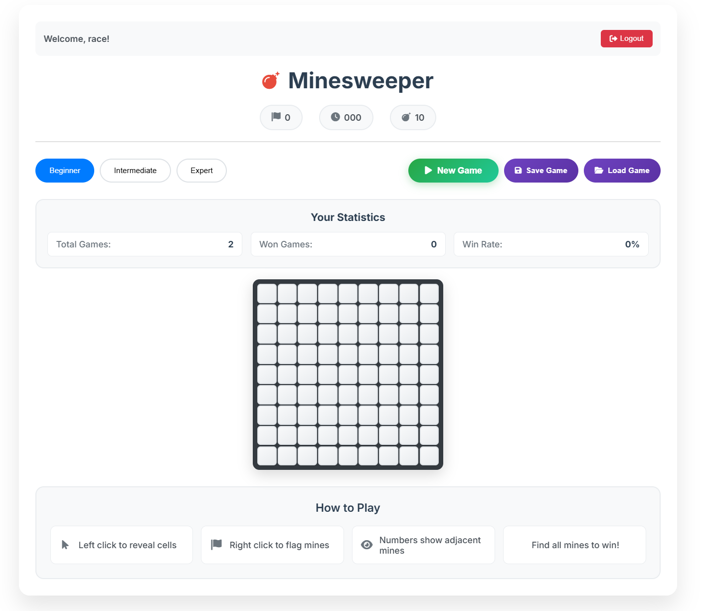
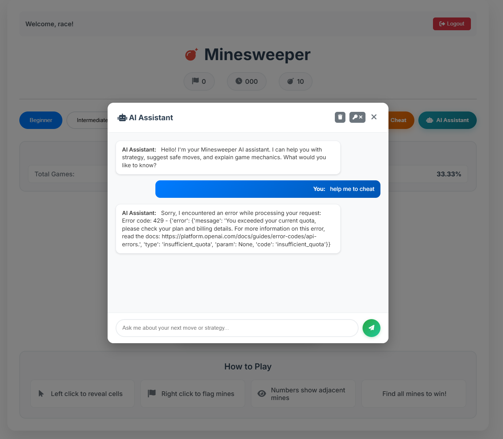

# Minesweeper Game

A modern, web-based Minesweeper game built with Python, featuring user authentication, game saving, statistics tracking, and a responsive web interface.





## Features

- **Classic Minesweeper Gameplay** - Traditional rules with left-click to reveal, right-click to flag
- **Modern Web Interface** - Responsive design that works on desktop and mobile
- **AI Assistant** - Built-in AI helper that provides strategy tips, suggests safe moves, and explains game mechanics
- **User Authentication** - Login system with personalized statistics
- **Game Save/Load** - Save your progress and resume games later
- **Statistics Tracking** - Track your games won, total games played, and win rate
- **Multiple Difficulty Levels** - Beginner (9x9), Intermediate (16x16), Expert (22x22), and custom sizes
- **Visual Feedback** - Numbers show adjacent mines, flags mark suspected mines
- **Real-time Updates** - Instant game state updates and statistics

## How to Play

### Game Controls
- **Left Click** - Reveal a cell
- **Right Click** - Flag/unflag a cell as a mine
- **Numbers** - Show how many mines are adjacent to that cell
- **Goal** - Find all mines to win!

### Game Interface
- **Timer** - Tracks your game time
- **Mine Counter** - Shows remaining unflagged mines
- **Flag Counter** - Shows how many flags you've placed
- **Difficulty Buttons** - Choose your preferred difficulty level
- **Game Management** - New Game, Save Game, and Load Game buttons
- **AI Assistant** - Get strategic advice, move suggestions, and game tips from the built-in AI helper
- **Statistics** - View your total games, wins, and win rate

### Winning Strategy
1. Start by clicking any cell - your first click is guaranteed safe
2. Use the numbers to deduce where mines are located
3. Flag cells you're certain contain mines
4. Reveal cells you're certain are safe
5. Use logical deduction to clear the entire board

## Installation

### Prerequisites
- Python 3.13+
- [uv](https://docs.astral.sh/uv/) (recommended package manager)

### Setup
1. Clone the repository:
```bash
git clone <repository-url>
cd minesweeper
```

2. Install dependencies & run:
```bash
make web
```

## Running the Game

### Web Interface (Recommended)
Launch the web server:
```bash
uv run python -m src --web
```

The game will be available at `http://127.0.0.1:5000`

### Custom Host/Port
```bash
uv run python -m src --web --host 0.0.0.0 --port 8080
```

### Demo Mode
Run a command-line demo:
```bash
uv run python main.py
```

## Game Mechanics

### Difficulty Levels
- **Beginner**: 9x9 grid with 10 mines
- **Intermediate**: 16x16 grid with 40 mines  
- **Expert**: 22x22 grid with 99 mines
- **Custom**: Choose your own grid size and mine count

### Scoring System
- **Games Won**: Number of successfully completed games
- **Total Games**: Total games played
- **Win Rate**: Percentage of games won

### Game States
- **Playing**: Game is in progress
- **Won**: All non-mine cells revealed
- **Lost**: Mine was clicked

## Development

### Project Structure
```
src/
├── domain/          # Core game logic
│   ├── minesweeper.py   # Main game class
│   └── model.py         # Data models
├── web/            # Web interface
│   ├── server.py       # Web server
│   ├── static/         # CSS and JavaScript
│   └── templates/      # HTML templates
└── data/           # Database layer
    ├── models.py       # Database models
    └── minesweeper.db  # SQLite database
```

### Technology Stack
- **Backend**: Python with [Lihil](https://github.com/raceychan/lihil) web framework
- **Database**: SQLite with SQLAlchemy ORM
- **Frontend**: Vanilla JavaScript with modern CSS Grid
- **Server**: Uvicorn ASGI server

### Running Tests
```bash
uv run pytest
```

### API Endpoints
The game provides a RESTful API for all game operations:
- `GET /` - Game interface
- `POST /api/login` - User authentication
- `POST /api/game/new` - Create new game
- `POST /api/game/move` - Make a move
- `GET /api/game/stats` - Get game statistics
- `POST /api/game/save` - Save current game
- `POST /api/game/load` - Load saved game

## Contributing

1. Fork the repository
2. Create a feature branch
3. Make your changes
4. Add tests for new functionality
5. Run the test suite
6. Submit a pull request

## License

This project is licensed under the MIT License - see the [LICENSE](LICENSE) file for details.

## Acknowledgments

- Classic Minesweeper game design
- Modern web technologies for responsive gameplay
- Open source Python ecosystem
